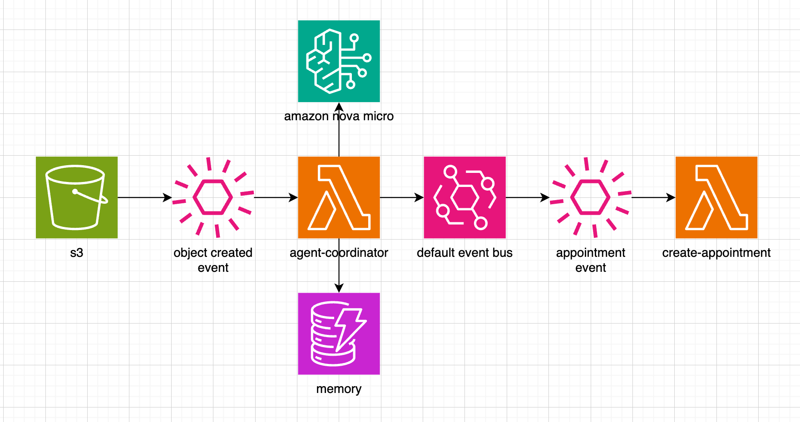

# Medical AI Agent Microservice

An intelligent serverless medical analysis system that processes laboratory results using AI agents and provides automated clinical decision support.

## Architecture



The system follows an event-driven serverless architecture:

1. **S3** - Lab results uploaded trigger object creation events
2. **EventBridge** - Routes S3 events to the medical agent coordinator
3. **Lambda (Agent Coordinator)** - Processes lab data using Amazon Nova Micro AI
4. **DynamoDB (Memory)** - Stores patient history and analysis results
5. **EventBridge** - Publishes medical events (alerts, appointments)
6. **Lambda (Create Appointment)** - Handles downstream appointment creation

## Key Features

- **AI-Powered Analysis** - Uses Amazon Bedrock Nova Micro for intelligent lab result interpretation
- **Critical Safety Rules** - Deterministic checks for emergency values (glucose >300 or <50 mg/dL)
- **Patient Memory** - Maintains 7-year medical history for context-aware decisions
- **Multi-Specialist Routing** - Automatic specialist assignment (endocrinologist, cardiologist, nephrologist)
- **Urgency Classification** - Three-tier urgency system (urgent, priority, routine)
- **Portuguese Language Support** - Native Portuguese medical analysis

## Technology Stack

- **Runtime**: Python 3.12
- **Framework**: Serverless Framework 4.18
- **AI Library**: Strands Agent Framework
- **Cloud Services**: AWS Lambda, DynamoDB, EventBridge, Bedrock, S3
- **Deployment**: Infrastructure as Code

## Project Structure

```
src/
├── agents/
│   └── medical_agent/
│       └── handler.py          # Main medical analysis logic
└── tools/
    ├── event_creator.py        # Medical event generation
    └── memory_manager.py       # Patient data persistence
```

## Prerequisites

- AWS Account with Bedrock access
- Node.js 18+ and npm
- Python 3.12
- AWS CLI configured
- Serverless Framework CLI

## Installation

1. **Clone and install dependencies**:
```bash
npm install
pip install -r requirements.txt
```

2. **Deploy infrastructure**:
```bash
serverless deploy
```

### Critical Thresholds

Modify critical values in `src/agents/medical_agent/handler.py:138`:

```python
def check_critical_values(lab_data: Dict) -> Dict:
    glucose = results.get('glucose', {}).get('value', 0)
    
    if glucose > 300:  # Hyperglycemia threshold
        return {'is_critical': True, 'action': 'emergency_appointment'}
    
    if glucose < 50:   # Hypoglycemia threshold
        return {'is_critical': True, 'action': 'emergency_appointment'}
```

## Usage

### Input Format

Lab data should be uploaded to S3 in JSON format:

```json
{
  "patient_id": "PAT001",
  "exam_date": "2024-01-15T10:30:00Z",
  "lab_results": {
    "glucose": {"value": 250, "unit": "mg/dL", "reference": "70-99"},
    "hba1c": {"value": 8.5, "unit": "%", "reference": "<7.0"}
  },
  "patient_info": {
    "age": 45,
    "gender": "M",
    "conditions": ["diabetes_type2"]
  }
}
```

### Output Events

The system generates medical events based on analysis:

```json
{
  "patient_id": "PAT001",
  "event_type": "alert",
  "specialist": "endocrinologista",
  "urgency": "urgent",
  "reasoning": "Hiperglicemia crítica: 250mg/dL. Ajuste imediato necessário.",
  "created_at": "2024-01-15T10:35:00Z"
}
```

## Agent Tools

### Memory Manager
- `get_patient_memory(patient_id, days_back)` - Retrieve patient history
- `save_to_memory(patient_id, event_type, data)` - Store analysis results

### Event Creator
- `create_event(event_type, patient_id, specialist, urgency, reasoning)` - Generate medical events