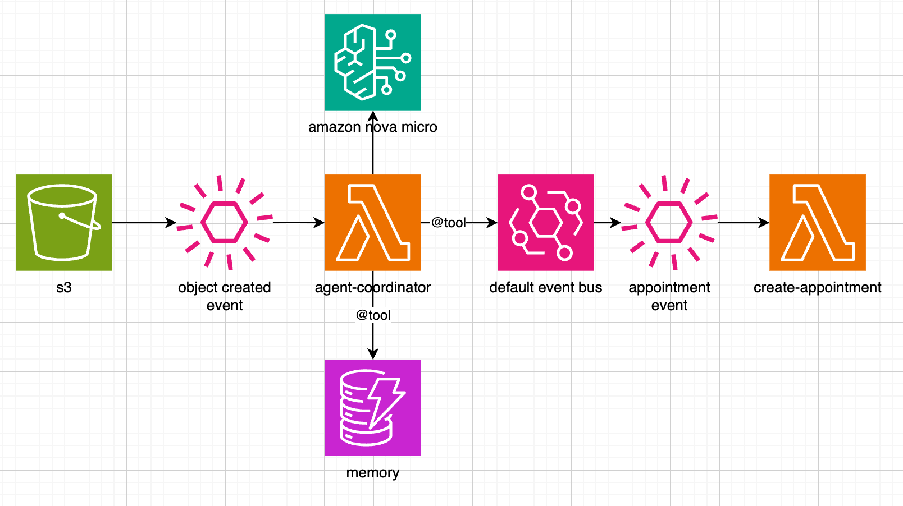

# Medical Agent Microservice

A VoltAgent-powered medical analysis system that processes laboratory exam results and provides intelligent clinical insights through AI. The system uses Amazon Bedrock with Nova Micro model to analyze patient data and create medical events and appointments.

## Architecture



The system follows an event-driven microservices architecture:

1. **S3 Storage** → **Object Created Event** → **Agent Coordinator**
2. **Agent Coordinator** uses Amazon Nova Micro AI model and accesses **DynamoDB Memory** storage
3. **Agent Coordinator** publishes events to **Default Event Bus** 
4. **Event Bus** triggers downstream services like **Create Appointment** Lambda functions

## Features

- **Medical Agent**: AI-powered analysis of laboratory results
- **Memory System**: DynamoDB-based patient record storage and retrieval
- **Event System**: EventBridge integration for medical workflows
- **Multi-language Support**: Portuguese medical analysis capabilities

## Getting Started

### Prerequisites
- Node.js >= 20.0.0
- AWS credentials configured
- DynamoDB and EventBridge access

### Installation
```bash
npm install
```

### Environment Setup
Create a `.env` file with your AWS credentials:
```
AWS_ACCESS_KEY_ID=your_access_key
AWS_SECRET_ACCESS_KEY=your_secret_key
AWS_SESSION_TOKEN=your_session_token (optional)
```

### Running the Application
```bash
# Development mode
npm run dev

# Local testing
npm run local-test

# Build and start
npm run build
npm start
```

## Local Testing

The `local-test/` directory contains test files for validating the medical agent:

- **`index.ts`**: Main test runner with medical agent configuration
- **Test Data Files**: Sample patient data with different glucose scenarios:
  - `normal_glucose.json` - Normal glucose levels
  - `high_glucose.json` - High glucose readings
  - `critical_high_glucose.json` - Critically high glucose (urgent)
  - `critical_low_glucose.json` - Critically low glucose (urgent)
  - `sample-patient-data.json` - General patient data sample

### Running Tests
```bash
npm run local-test
```

The local test environment allows you to:
- Test medical analysis algorithms with real patient data
- Validate urgent/priority alert generation
- Verify memory storage and retrieval functionality
- Test event creation for different medical scenarios

## Medical Decision Rules

The agent follows clinical protocols for:
- **Urgent Cases** (0-24h): Glucose >300 or <50 mg/dL, Creatinine >3.0 mg/dL
- **Priority Cases** (1-7 days): HbA1c >10%, multiple critical values
- **Routine Cases** (30-90 days): Normal/stable values

Available specialists: endocrinologist, cardiologist, nephrologist, generalist
