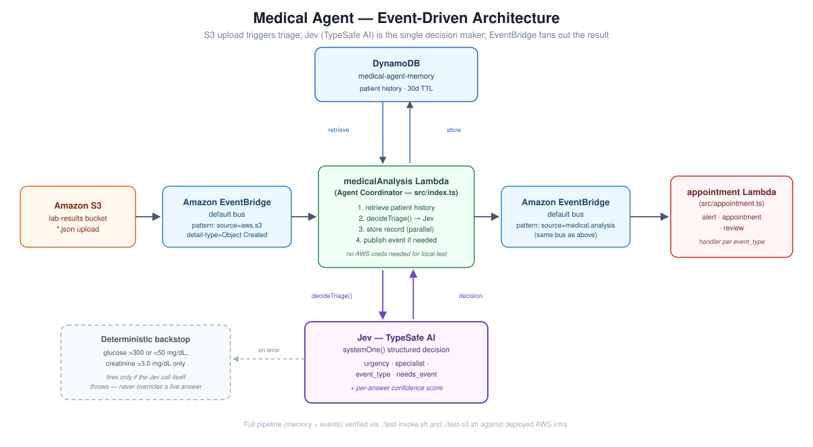

# Medical Agent Microservice

A VoltAgent-powered medical analysis system that processes laboratory exam results and provides intelligent clinical insights through AI. The system uses [Jev](https://typesafe.ai), TypeSafe AI's structured decision model, to triage patient data and create medical events and appointments.

## Architecture



The system follows an event-driven microservices architecture:

1. **S3 Storage** → **Object Created Event** → **Agent Coordinator**
2. **Agent Coordinator** uses Jev (TypeSafe AI) for triage decisions and accesses **DynamoDB Memory** storage
3. **Agent Coordinator** publishes events to **Default Event Bus** 
4. **Event Bus** triggers downstream services like **Create Appointment** Lambda functions

The deterministic backstop in `src/triage.ts` only fires if the Jev call itself
throws (network/API error) — it never second-guesses a live Jev answer, and it
only covers the handful of unambiguously critical thresholds, not general
triage.

## Features

- **Medical Agent**: AI-powered analysis of laboratory results
- **Memory System**: DynamoDB-based patient record storage and retrieval
- **Event System**: EventBridge integration for medical workflows
- **Multi-language Support**: Portuguese medical analysis capabilities

## Getting Started

### Prerequisites
- Node.js >= 20.0.0
- AWS credentials configured
- DynamoDB and EventBridge access

### Installation
```bash
npm install
```

### Environment Setup
Create a `.env` file with your AWS credentials and TypeSafe API key:
```
AWS_ACCESS_KEY_ID=your_access_key
AWS_SECRET_ACCESS_KEY=your_secret_key
AWS_SESSION_TOKEN=your_session_token (optional)
TYPESAFE_API_KEY=your_typesafe_api_key
```

### Running the Application
```bash
# Development mode
npm run dev

# Local testing
npm run local-test

# Build and start
npm run build
npm start
```

## Local Testing

The `local-test/` directory contains a fixture-driven sanity check for
Jev's triage decisions, plus the sample lab-result payloads it reads:

- **`index.ts`**: Calls `decideTriage()` from `src/triage.ts` directly —
  the exact function the production Lambda handler uses — against each
  fixture below, and prints the resulting urgency, specialist, event type,
  and reasoning. It only needs `TYPESAFE_API_KEY`; it does not touch
  DynamoDB or EventBridge, so no AWS credentials are required.
- **Fixtures** — sample patient lab results covering different scenarios:
  - `normal_glucose.json` - Normal glucose levels (expected: routine)
  - `high_glucose.json` - High (non-critical) glucose
  - `critical_high_glucose.json` - Critically high glucose (expected: urgent)
  - `critical_low_glucose.json` - Critically low glucose (expected: urgent)
  - `sample-patient-data.json` - General patient data with multiple abnormal values

### Running the fixture check
```bash
npm run local-test
```
This runs once and exits non-zero if `normal_glucose.json`,
`critical_high_glucose.json`, or `critical_low_glucose.json` don't come
back with the expected urgency. The other two fixtures are borderline
judgment calls, so they're logged for review but not asserted.

If a fixture's `reasoning` starts with "Jev indisponível", the
deterministic backstop in `src/triage.ts` engaged instead of a live Jev
call — check that `TYPESAFE_API_KEY` is set in `.env`.

### Testing the full pipeline (memory + events) against AWS
`local-test/index.ts` does not exercise `memoryTool`, `eventsTool`, or the
Lambda `handler` itself. To test the full event-driven pipeline —
including DynamoDB storage/retrieval and EventBridge event creation — use:
```bash
./test-invoke.sh   # invoke src/index.handler locally via `sls invoke local`
./test-s3.sh       # upload fixtures to S3 to trigger the deployed pipeline
```

## Medical Decision Rules

Every triage decision (urgency, specialist, event type, and whether an event
is warranted at all) is made by [Jev](https://typesafe.ai), TypeSafe AI's
structured decision model, via `src/triage.ts`. If the Jev call itself fails,
a deterministic backstop still raises an urgent alert for the handful of
unambiguously life-threatening values below — it never overrides a
successful Jev judgment, only covers Jev being unreachable. The agent
follows clinical protocols for:
- **Urgent Cases** (0-24h): Glucose >300 or <50 mg/dL, Creatinine >3.0 mg/dL
- **Priority Cases** (1-7 days): HbA1c >10%, multiple critical values
- **Routine Cases** (30-90 days): Normal/stable values

Available specialists: endocrinologist, cardiologist, nephrologist, generalist

## Why Jev for Triage

Triage used to be a hardcoded glucose-only threshold check feeding a
free-text Bedrock agent prompt: one lab value decided urgency, everything
else was prose the caller had to parse, and there was no signal for how
confident the "decision" actually was. `src/triage.ts` replaced that with a
single structured call to Jev's `systemOne` API that answers urgency,
specialist, event type, and whether an event is warranted at all — same
shape every time, plus a confidence score per answer.

To check whether that's actually working well rather than just assuming it,
each fixture in `local-test/` was run **4 times against live Jev** and
measured for latency and run-to-run consistency:

| Fixture | Avg latency | Urgency/specialist consistent? | event_type confidence |
|---|---|---|---|
| `normal_glucose.json` | 296ms | ✅ 4/4 | 0.91 |
| `high_glucose.json` | 132ms | ✅ 4/4 | 0.24 |
| `critical_high_glucose.json` | 128ms | ✅ 4/4 | 1.00 |
| `critical_low_glucose.json` | 185ms | ✅ 4/4 | 0.99 |
| `sample-patient-data.json` (multiple abnormal values) | 179ms | ✅ 4/4 urgency, ❌ event_type flipped | 0.26 |

**What this shows:**
- **Latency is a non-issue.** ~100–230ms per call (one 564ms cold-start
  outlier), well inside the Lambda's async event-driven budget — nothing is
  waiting on this synchronously.
- **On clear-cut cases, it's rock solid.** Urgency, specialist, and
  `needs_event` never changed across repeated calls on any fixture,
  including the two critical-glucose cases, where confidence sat at
  0.98–1.00 on every question.
- **On a genuinely ambiguous case, Jev says so instead of guessing
  silently.** `sample-patient-data.json` has several abnormal values at
  once with no single dominant one; its `event_type` answer flip-flopped
  between "review" and "appointment" across identical repeated calls — and
  that's exactly the case where Jev's own confidence score was lowest
  (0.24–0.26 vs. 0.91–1.00 everywhere else). The old hardcoded-threshold
  check had no way to express "I'm not sure"; it just picked something. A
  free-text prompt would bury that same uncertainty in prose. Jev's
  confidence score makes the ambiguity visible and machine-readable instead
  of hidden.

**Known gap:** that confidence score isn't surfaced anywhere useful yet —
`decideTriage()` only embeds it in the free-text `reasoning` string, so
`src/index.ts` can't act on it (e.g. defaulting `event_type` to the safer
"review" when confidence is below some threshold). Adding a structured
`confidence` field to `TriageDecision` would let the low-confidence case
above be handled deliberately instead of by whichever answer Jev happened
to land on that call.
