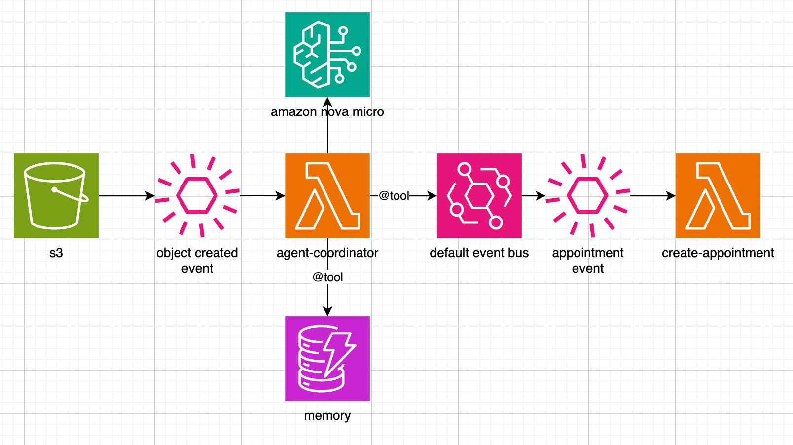

# Medical Agent Microservice

A VoltAgent-powered medical analysis system that processes laboratory exam results and provides intelligent clinical insights through AI. The system uses Amazon Bedrock with Nova Micro model to analyze patient data and create medical events and appointments.

## Architecture



The system follows an event-driven microservices architecture:

1. **S3 Storage** → **Object Created Event** → **Agent Coordinator**
2. **Agent Coordinator** uses Amazon Nova Micro AI model and accesses **DynamoDB Memory** storage
3. **Agent Coordinator** publishes events to **Default Event Bus** 
4. **Event Bus** triggers downstream services like **Create Appointment** Lambda functions

## Features

- **Medical Agent**: AI-powered analysis of laboratory results
- **Memory System**: DynamoDB-based patient record storage and retrieval
- **Event System**: EventBridge integration for medical workflows
- **Multi-language Support**: Portuguese medical analysis capabilities

## Getting Started

### Prerequisites
- Node.js >= 20.0.0
- AWS credentials configured
- DynamoDB and EventBridge access

### Installation
```bash
npm install
```

### Environment Setup
Create a `.env` file with your AWS credentials and TypeSafe API key:
```
AWS_ACCESS_KEY_ID=your_access_key
AWS_SECRET_ACCESS_KEY=your_secret_key
AWS_SESSION_TOKEN=your_session_token (optional)
TYPESAFE_API_KEY=your_typesafe_api_key
```

### Running the Application
```bash
# Development mode
npm run dev

# Local testing
npm run local-test

# Build and start
npm run build
npm start
```

## Local Testing

The `local-test/` directory contains a fixture-driven sanity check for
Jev's triage decisions, plus the sample lab-result payloads it reads:

- **`index.ts`**: Calls `decideTriage()` from `src/triage.ts` directly —
  the exact function the production Lambda handler uses — against each
  fixture below, and prints the resulting urgency, specialist, event type,
  and reasoning. It only needs `TYPESAFE_API_KEY`; it does not touch
  DynamoDB or EventBridge, so no AWS credentials are required.
- **Fixtures** — sample patient lab results covering different scenarios:
  - `normal_glucose.json` - Normal glucose levels (expected: routine)
  - `high_glucose.json` - High (non-critical) glucose
  - `critical_high_glucose.json` - Critically high glucose (expected: urgent)
  - `critical_low_glucose.json` - Critically low glucose (expected: urgent)
  - `sample-patient-data.json` - General patient data with multiple abnormal values

### Running the fixture check
```bash
npm run local-test
```
This runs once and exits non-zero if `normal_glucose.json`,
`critical_high_glucose.json`, or `critical_low_glucose.json` don't come
back with the expected urgency. The other two fixtures are borderline
judgment calls, so they're logged for review but not asserted.

If a fixture's `reasoning` starts with "Jev indisponível", the
deterministic backstop in `src/triage.ts` engaged instead of a live Jev
call — check that `TYPESAFE_API_KEY` is set in `.env`.

### Testing the full pipeline (memory + events) against AWS
`local-test/index.ts` does not exercise `memoryTool`, `eventsTool`, or the
Lambda `handler` itself. To test the full event-driven pipeline —
including DynamoDB storage/retrieval and EventBridge event creation — use:
```bash
./test-invoke.sh   # invoke src/index.handler locally via `sls invoke local`
./test-s3.sh       # upload fixtures to S3 to trigger the deployed pipeline
```

## Medical Decision Rules

Every triage decision (urgency, specialist, event type, and whether an event
is warranted at all) is made by [Jev](https://typesafe.ai), TypeSafe AI's
structured decision model, via `src/triage.ts`. If the Jev call itself fails,
a deterministic backstop still raises an urgent alert for the handful of
unambiguously life-threatening values below — it never overrides a
successful Jev judgment, only covers Jev being unreachable. The agent
follows clinical protocols for:
- **Urgent Cases** (0-24h): Glucose >300 or <50 mg/dL, Creatinine >3.0 mg/dL
- **Priority Cases** (1-7 days): HbA1c >10%, multiple critical values
- **Routine Cases** (30-90 days): Normal/stable values

Available specialists: endocrinologist, cardiologist, nephrologist, generalist
